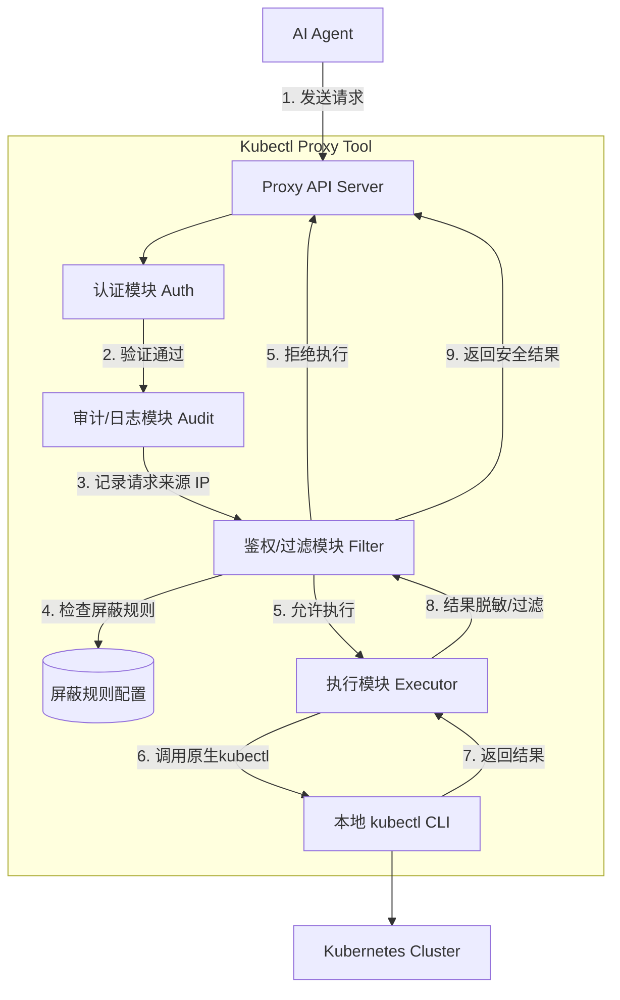

# agent-kubectl-gateway

AI Agent kubectl 代理 CLI 工具 - 为 AI Agent 提供安全、可控的 Kubernetes 集群访问能力。

## 项目简介

agent-kubectl-gateway 是一个基于 Go 语言开发的代理服务，为 AI Agent 提供安全访问 Kubernetes 集群的能力。通过结构化输入、多层安全防护和完善的审计日志，确保 AI Agent 在执行 kubectl 命令时的安全性和可追溯性。

## 系统架构



## 核心组件

### 认证模块 (Auth Module)
负责接收请求，验证请求合法性。

### 审计/日志模块 (Audit/Logging Module)
记录所有请求的详细信息，包括请求时间、来源 IP、Agent 标识、执行的命令、执行结果状态等。采用 JSON 格式记录，便于接入 ELK、Loki 等日志分析系统。

### 鉴权/过滤模块 (Authz/Filter Module)
- **命令前置拦截**: 根据配置的动词白名单/黑名单规则，拦截不允许执行的命令（如 `delete` 操作）
- **结果后置过滤**: 对 `kubectl` 返回的结果进行脱敏处理（如将 `kubectl get secret` 的内容替换为 `***`）

### 执行模块 (Execution Module)
负责将验证通过的命令传递给底层的 `kubectl` 二进制文件执行，并捕获标准输出和标准错误。支持超长输出截断，防止大日志导致内存溢出或 LLM Token 超限。

## 特性

- **结构化输入防注入**: 采用结构化 JSON 输入方式，从根本上避免 Shell 注入和复合命令风险
- **多层安全防护**: 动词白名单/黑名单 + 结果脱敏 + 审计日志
- **完善的审计日志**: 记录所有请求的完整生命周期，支持日志轮转和结构化输出
- **灵活的权限控制**: 支持动词白名单/黑名单、命名空间级别的资源访问控制
- **输出脱敏与过滤**: 自动对敏感信息（如 Secret 内容）进行脱敏处理
- **输出长度限制**: 自动截断超长输出，防止内存溢出
- **高性能**: 使用 Go 语言开发，支持并发执行和流式读取
- **易于部署**: 支持 Docker 和 Kubernetes 部署

## 安全性考量

### 结构化输入防注入
- **禁止使用 Shell 执行**: 工具绝对不通过 shell（如 `sh -c` 或 `bash -c`）来执行传入的命令
- **结构化输入**: LLM 传入的是结构化的 `verb`, `resource`, `namespace` 等字段，而不是命令字符串
- **参数安全组装**: 从结构化输入中提取各字段，直接组装为参数数组，杜绝命令注入风险

### 访问控制
- **动词白名单/黑名单**: 精确控制允许或禁止执行的 kubectl 操作动词
- **传输安全**: 必须启用 HTTPS (TLS) 加密通信，防止数据在网络中被窃听
- **最小权限原则**: 运行该 Proxy 工具的系统用户应仅具有执行 `kubectl` 的权限

### 审计与监控
- **完整的审计日志**: 记录每次请求的时间戳、来源 IP、命令、状态、耗时等
- **结构化日志输出**: JSON 格式便于接入日志分析系统
- **日志轮转**: 支持按大小和时间轮转，防止日志文件撑爆磁盘

### 资源保护
- **并发控制**: 限制同时执行的命令数量，防止资源耗尽
- **超时控制**: 防止命令无限等待
- **输出长度限制**: 防止大输出导致内存溢出
- **限流与防刷**: 在 API 层添加 Rate Limit，防止恶意 Agent 发起大量请求

## 快速开始

### 1. 克隆项目

```bash
git clone https://github.com/your-repo/agent-kubectl-gateway.git
cd agent-kubectl-gateway
```

### 2. 配置

编辑 [`configs/config.yaml`](configs/config.yaml)，配置规则等。

```yaml
server:
  port: 8080
  host: "0.0.0.0"

rules:
  verb_allowlist:
    - "get"
    - "describe"
    - "logs"
    - "apply"
    - "create"
    - "patch"
    - "rollout"
    - "scale"
    - "top"
  
  verb_blocklist:
    - "delete"
    - "exec"
    - "port-forward"
  
  masking:
    - resource: "secrets"
      namespaces: ["*"]
      action: "mask"

execution:
  max_output_length: 10000

audit:
  log_file: "/var/log/agent-kubectl-gateway/audit.log"
  level: "info"
  format: "json"
  max_size_mb: 100
  max_backups: 30
  max_age_days: 30
  compress: true
```

### 3. 构建

```bash
make build
```

### 4. 运行

```bash
./build/agent-kubectl-gateway
```

## API 文档

### 执行命令

**POST** `/execute`

**Request Body**:
```json
{
  "verb": "get",
  "resource": "pods",
  "namespace": "default",
  "name": "",
  "subresource": "",
  "options": {
    "labelSelector": "app=nginx",
    "fieldSelector": "",
    "limit": 100,
    "container": "",
    "tailLines": 200,
    "since": "",
    "follow": false,
    "previous": false,
    "allNamespaces": false,
    "output": "json"
  },
  "output": "json",
  "mode": "structured"
}
```

**Response**:
```json
{
  "request_id": "req-20260316-001",
  "status": "success",
  "exit_code": 0,
  "stdout": "NAME                     READY   STATUS    RESTARTS   AGE\nnginx-deployment-xxx     1/1     Running   0          2d",
  "stderr": "",
  "truncated": false,
  "duration_ms": 145,
  "response_size_bytes": 1024,
  "blocked_reason": ""
}
```

### API 请求示例

#### 场景 1：查询资源列表

```bash
curl -X POST http://localhost:8080/execute \
  -H "Content-Type: application/json" \
  -d '{
    "verb": "get",
    "resource": "pods",
    "namespace": "default",
    "options": {
      "labelSelector": "app=nginx",
      "limit": 100
    },
    "output": "json",
    "mode": "structured"
  }'
```

#### 场景 2：查询单个资源详情

```bash
curl -X POST http://localhost:8080/execute \
  -H "Content-Type: application/json" \
  -d '{
    "verb": "get",
    "resource": "pod",
    "namespace": "default",
    "name": "nginx-pod",
    "output": "yaml",
    "mode": "structured"
  }'
```

#### 场景 3：查询日志

```bash
curl -X POST http://localhost:8080/execute \
  -H "Content-Type: application/json" \
  -d '{
    "verb": "logs",
    "resource": "pod",
    "namespace": "default",
    "name": "nginx-pod",
    "options": {
      "tailLines": 100,
      "since": "1h",
      "container": "nginx"
    },
    "mode": "structured"
  }'
```

#### 场景 4：应用配置

```bash
curl -X POST http://localhost:8080/execute \
  -H "Content-Type: application/json" \
  -d '{
    "verb": "apply",
    "resource": "-f",
    "namespace": "default",
    "options": {
      "output": "yaml"
    },
    "mode": "structured"
  }'
```

## 审计日志

### 日志格式

审计日志采用 JSON 格式，便于接入日志分析系统。

### 日志字段

| 字段 | 类型 | 说明 |
|------|------|------|
| `timestamp` | string | 请求发生的时间戳（ISO 8601 格式） |
| `source_ip` | string | 发起请求的来源 IP 地址 |
| `command` | string | 实际请求执行的完整 kubectl 命令及参数 |
| `status` | string | 执行结果状态：`success`、`failed`、`intercepted` |
| `duration_ms` | number | 命令执行或请求处理的耗时（毫秒） |
| `response_size_bytes` | number | 最终返回给 Agent 的数据大小（字节数） |
| `error_message` | string | （可选）如果执行失败或被拦截，记录具体的错误原因 |

### 日志示例

**成功请求**:
```json
{
  "timestamp": "2026-03-16T10:05:23.123Z",
  "source_ip": "192.168.1.100",
  "command": "kubectl get pods -n default",
  "status": "success",
  "duration_ms": 145,
  "response_size_bytes": 1024
}
```

**被拦截请求**:
```json
{
  "timestamp": "2026-03-16T10:06:01.456Z",
  "source_ip": "192.168.1.100",
  "command": "kubectl delete namespace kube-system",
  "status": "intercepted",
  "duration_ms": 2,
  "response_size_bytes": 85,
  "error_message": "Command execution denied by proxy policy. Reason: 'delete' operations are not allowed."
}
```

## 配置说明

### Server 配置

```yaml
server:
  port: 8080              # 服务监听端口
  host: "0.0.0.0"         # 服务监听地址
  tls_cert: ""            # TLS 证书路径（可选）
  tls_key: ""             # TLS 私钥路径（可选）
```

### Auth 配置

```yaml
auth:
  # 认证配置（可选）
```

### Rules 配置

```yaml
rules:
  # 动词白名单：允许执行的 kubectl 操作动词
  # 注意：白名单优先级高于黑名单，如果配置了白名单，则只允许白名单中的动词
  verb_allowlist:
    - "get"
    - "describe"
    - "logs"
    - "apply"
    - "create"
    - "patch"
    - "rollout"
    - "scale"
    - "top"
  
  # 动词黑名单：禁止执行的 kubectl 操作动词
  # 注意：黑名单仅在未配置白名单时生效
  verb_blocklist:
    - "delete"
    - "exec"
    - "port-forward"
  
  # 脱敏规则：对特定资源的输出进行脱敏
  masking:
    - resource: "secrets"
      namespaces: ["*"]           # 作用的命名空间，*表示所有
      action: "mask"              # mask表示替换为***，drop表示直接返回空
    
    # 字段过滤规则：移除特定的 JSONPath/YAML 字段
    - resource: "*"
      namespaces: ["*"]
      action: "filter_fields"
      fields:
        - "metadata.annotations.kubectl.kubernetes.io/last-applied-configuration"
        - "metadata.managedFields"
        - "metadata.creationTimestamp"
        - "status"
      description: "过滤掉 kubectl last-applied-configuration 注解、managedFields、creationTimestamp 和 status 字段"
```

### Execution 配置

```yaml
execution:
  max_output_length: 10000  # 最大输出长度（字符数），超过此长度将被截断
  timeout_seconds: 30       # 命令执行超时时间（秒）
  max_concurrent: 10       # 最大并发执行数量
```

### Audit 配置

```yaml
audit:
  log_file: "/var/log/agent-kubectl-gateway/audit.log"  # 审计日志文件路径
  level: "info"                                        # 日志级别
  format: "json"                                       # 日志格式，固定为 json
  max_size_mb: 100                                     # 单个日志文件最大大小（MB）
  max_backups: 30                                      # 最大保留的旧日志文件数量
  max_age_days: 30                                     # 日志最大保留天数
  compress: true                                       # 是否压缩旧日志
```

## LLM 集成

### Tool/Function Calling 定义

为了让 LLM（AI Agent）能够自主调用该代理工具，需要提供以下工具定义：

```json
{
  "name": "execute_kubectl_command",
  "description": "执行 Kubernetes kubectl 命令以查询集群状态或资源信息。该工具通过安全的代理执行命令，采用结构化输入方式，部分敏感操作（如 delete, exec）可能会被拒绝，敏感数据（如 Secret 内容）会被自动脱敏。注意：查询日志时，请务必主动使用 options.tailLines 或 options.since 等参数限制输出长度，避免日志超长被截断。",
  "parameters": {
    "type": "object",
    "properties": {
      "verb": {
        "type": "string",
        "description": "kubectl 操作动词，如 get, describe, logs, apply, create 等",
        "enum": ["get", "describe", "logs", "apply", "create", "patch", "rollout", "scale", "top", "exec", "port-forward", "delete"]
      },
      "resource": {
        "type": "string",
        "description": "Kubernetes 资源类型，如 pods, deployments, services, nodes, namespaces, secrets, configmaps 等"
      },
      "namespace": {
        "type": "string",
        "description": "命名空间，如 default, kube-system。对于集群级别资源（如 nodes, namespaces）可为空字符串",
        "default": ""
      },
      "name": {
        "type": "string",
        "description": "资源名称，如 pod-name, deployment-name。查询所有资源时可为空字符串",
        "default": ""
      },
      "subresource": {
        "type": "string",
        "description": "子资源类型，如 log, status, scale, exec 等。仅在需要访问子资源时使用",
        "default": ""
      },
      "options": {
        "type": "object",
        "description": "命令选项参数",
        "properties": {
          "labelSelector": {
            "type": "string",
            "description": "标签选择器，如 app=nginx, tier=frontend",
            "default": ""
          },
          "fieldSelector": {
            "type": "string",
            "description": "字段选择器，如 status.phase=Running",
            "default": ""
          },
          "limit": {
            "type": "integer",
            "description": "返回结果数量限制",
            "default": 100
          },
          "container": {
            "type": "string",
            "description": "容器名称，用于 logs 或 exec 命令",
            "default": ""
          },
          "tailLines": {
            "type": "integer",
            "description": "日志尾部行数，用于 logs 命令",
            "default": 200
          },
          "since": {
            "type": "string",
            "description": "时间范围，如 1h, 30m, 2d，用于 logs 命令",
            "default": ""
          },
          "follow": {
            "type": "boolean",
            "description": "是否持续跟踪日志输出",
            "default": false
          },
          "previous": {
            "type": "boolean",
            "description": "是否获取前一个容器的日志",
            "default": false
          },
          "allNamespaces": {
            "type": "boolean",
            "description": "是否查询所有命名空间",
            "default": false
          },
          "output": {
            "type": "string",
            "description": "输出格式，如 json, yaml, wide, name",
            "default": ""
          }
        }
      },
      "output": {
        "type": "string",
        "description": "输出格式，如 json, yaml, wide, name。优先级高于 options.output",
        "default": ""
      },
      "mode": {
        "type": "string",
        "description": "输入模式，固定为 structured 表示结构化输入",
        "enum": ["structured"],
        "default": "structured"
      }
    },
    "required": ["verb", "resource", "mode"]
  }
}
```

## 技术栈

- **语言**: Go 1.21+
- **Web 框架**: Gin
- **配置管理**: Viper
- **日志记录**: Zap + Lumberjack
- **命令执行**: os/exec 标准库
- **JSON 处理**: tidwall/gjson + tidwall/sjson
- **YAML 处理**: gopkg.in/yaml.v3

## 项目结构

```
agent-kubectl-gateway/
├── cmd/
│   └── agent-kubectl-gateway/
│       └── main.go                 # 程序入口
├── internal/
│   ├── server/
│   │   ├── server.go               # HTTP Server 初始化与路由注册
│   │   └── handler.go              # 请求处理函数
│   ├── auth/
│   │   └── auth.go                 # 请求验证
│   ├── audit/
│   │   └── audit.go                # 审计日志记录核心逻辑
│   ├── filter/
│   │   └── filter.go               # 命令前置拦截与结果后置过滤
│   ├── executor/
│   │   ├── executor.go             # 命令执行核心逻辑
│   │   └── builder.go              # 从结构化输入组装参数数组
│   ├── config/
│   │   └── config.go               # 配置文件加载与热更新
│   └── model/
│       └── model.go                # 共享数据结构定义
├── configs/
│   └── config.yaml                 # 默认配置文件
├── deploy/
│   ├── Dockerfile                  # Docker 镜像构建文件
│   └── k8s/
│       ├── deployment.yaml         # Kubernetes Deployment 配置
│       └── service.yaml            # Kubernetes Service 配置
├── docs/
│   └── plan/                       # 设计文档和实现计划
├── scripts/
│   ├── build.sh                    # 构建脚本
│   └── install.sh                  # 安装脚本
├── go.mod                          # Go 模块依赖定义
├── go.sum                          # 依赖版本锁定
├── Makefile                        # 构建、测试、部署命令集合
└── README.md                       # 项目说明文档
```

## 部署

### Docker 部署

```bash
# 构建镜像
docker build -t agent-kubectl-gateway:latest -f deploy/Dockerfile .

# 运行容器
docker run -d \
  --name agent-kubectl-gateway \
  -p 8080:8080 \
  -v $(pwd)/configs/config.yaml:/app/configs/config.yaml \
  -v /var/log/agent-kubectl-gateway:/var/log/agent-kubectl-gateway \
  -v ~/.kube/config:/root/.kube/config:ro \
  agent-kubectl-gateway:latest
```

### Kubernetes 部署

```bash
# 部署到 Kubernetes 集群
kubectl apply -f deploy/k8s/
```

## 构建

```bash
# 构建
make build

# 运行测试
make test

# 构建 Docker 镜像
make docker

# 清理
make clean
```

## 贡献

欢迎提交 Issue 和 Pull Request！

## 许可证

MIT License

## 相关文档

- [设计文档](docs/plan/2026-03-17-agent-kubectl-gateway-design.md)
- [实现计划](docs/plan/2026-03-17-agent-kubectl-gateway-implementation-plan.md)
