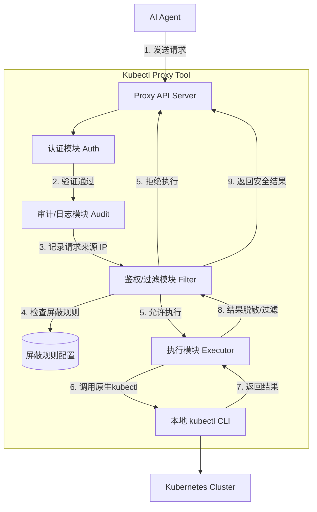
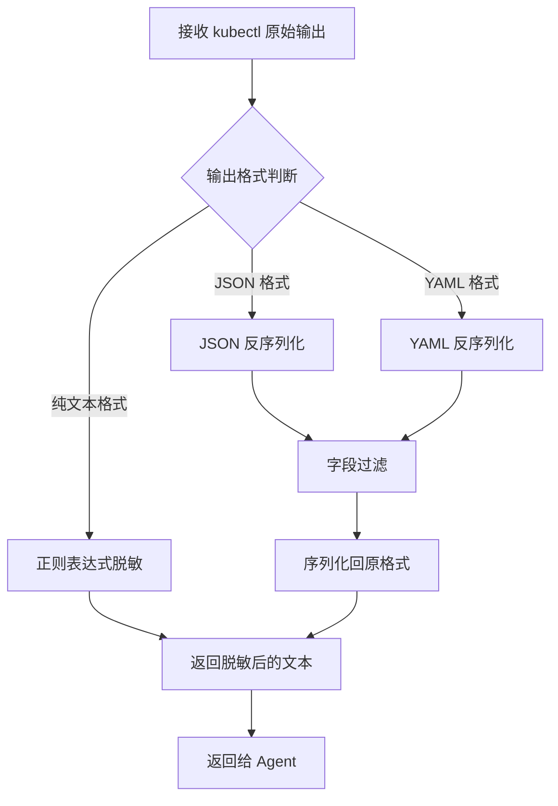
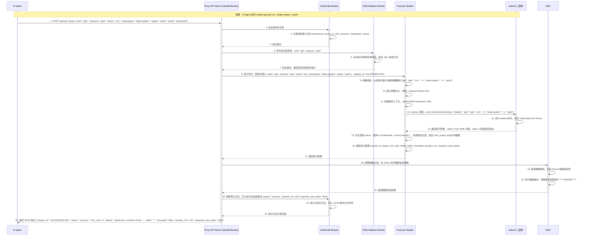

# AI Agent kubectl 代理 CLI 工具架构与实现方案 (agent-kubectl-gateway)

## 1. 系统架构图



## 2. 核心组件划分

- **认证模块 (Auth Module)**: 负责接收请求，验证请求合法性。
- **审计/日志模块 (Audit/Logging Module)**: 记录所有请求的详细信息，包括请求时间、来源 IP、执行的命令、执行结果状态等。详细设计见第 3 节。
- **鉴权/过滤模块 (Authz/Filter Module)**:
  - **命令前置拦截**: 根据配置的动词白名单/黑名单规则，拦截不允许执行的命令（如 `delete` 操作）。拦截规则针对的是 LLM 传入的结构化输入中的 `verb` 字段。
  - **结果后置过滤**: 对 `kubectl` 返回的结果进行脱敏处理（如将 `kubectl get secret` 的内容替换为 `***`）。
- **执行模块 (Execution Module)**: 负责将验证通过的命令传递给底层的 `kubectl` 二进制文件执行，并捕获标准输出和标准错误。
  - **超长输出截断**: 当命令（如 `kubectl logs` 或 `kubectl describe`）的输出超过配置的最大长度（如 10000 字符）时，自动截断输出，并在末尾追加提示信息（例如 `... [Output truncated. The log is too long. Please use flags like --tail=100 or --since=1h to limit the output.]`），防止大日志导致内存溢出或 LLM Token 超限。

## 3. 审计/日志模块设计

为了满足安全合规和问题排查的需求，agent-kubectl-gateway 代理工具必须实现完善的审计日志功能。

### 3.1 审计日志内容

审计日志需要记录每次请求的完整生命周期信息，关键字段包括：
- **timestamp**: 请求发生的时间戳（ISO 8601 格式）。
- **source_ip**: 发起请求的来源 IP 地址。
- **command**: 实际请求执行的完整 `kubectl` 命令及参数。
- **status**: 执行结果状态，枚举值包括：`success`（成功执行）、`failed`（执行报错）、`intercepted`（被安全规则拦截）。
- **duration_ms**: 命令执行或请求处理的耗时（毫秒）。
- **response_size_bytes**: 最终返回给 Agent 的数据大小（字节数）。
- **error_message**: （可选）如果执行失败或被拦截，记录具体的错误原因。

### 3.2 日志格式与存储

- **日志格式**: 强制采用结构化的 **JSON 格式** 记录审计日志，以便于后续接入 ELK、Loki 等日志分析系统进行查询和统计。
- **存储方式**: 默认写入本地文件系统。
- **日志轮转**: 支持日志文件的自动轮转（Log Rotation），按天切割日志文件，并支持配置最大保留天数、单文件最大大小等，防止日志文件撑爆磁盘（在 Go 中可使用 `gopkg.in/natefinch/lumberjack.v2` 库实现）。

### 3.3 审计日志示例

以下是一个成功的请求产生的审计日志条目示例：

```json
{
  "timestamp": "2026-03-16T10:05:23.123Z",
  "source_ip": "192.168.1.100",
  "command": "kubectl get pods -n default",
  "status": "success",
  "duration_ms": 145,
  "response_size_bytes": 1024
}
```

以下是一个被拦截的请求产生的审计日志条目示例：

```json
{
  "timestamp": "2026-03-16T10:06:01.456Z",
  "source_ip": "192.168.1.100",
  "command": "kubectl delete namespace kube-system",
  "status": "intercepted",
  "duration_ms": 2,
  "response_size_bytes": 85,
  "error_message": "Command execution denied by proxy policy. Reason: 'delete' operations are not allowed."
}
```

## 4. 配置设计

使用 YAML 格式进行配置，便于管理和阅读。

```yaml
# config.yaml
server:
  port: 8080
  host: "0.0.0.0"
  tls_cert: "/path/to/cert.pem"
  tls_key: "/path/to/key.pem"

audit:
  log_file: "/var/log/agent-kubectl-gateway/audit.log"
  level: "info"
  format: "json"          # 日志格式，固定为 json
  max_size_mb: 100        # 单个日志文件最大大小（MB）
  max_backups: 30         # 最大保留的旧日志文件数量
  max_age_days: 30        # 日志最大保留天数
  compress: true          # 是否压缩旧日志

execution:
  max_output_length: 10000 # 最大输出长度（字符数），超过此长度将被截断

rules:
  # 动词白名单：允许执行的 kubectl 操作动词
  # 注意：白名单优先级高于黑名单，如果配置了白名单，则只允许白名单中的动词
  verb_allowlist:
    - "get"
    - "describe"
    - "logs"
    - "apply"
    - "create"
    - "patch"
    - "rollout"
    - "scale"
    - "top"
  
  # 动词黑名单：禁止执行的 kubectl 操作动词
  # 注意：黑名单仅在未配置白名单时生效
  verb_blocklist:
    - "delete"
    - "exec"
    - "port-forward"
  
  # 脱敏规则：对特定资源的输出进行脱敏
  masking:
    - resource: "secrets"
      namespaces: ["*"] # 作用的命名空间，*表示所有
      action: "mask" # mask表示替换为***，drop表示直接返回空
    
    # 字段过滤规则：移除特定的 JSONPath/YAML 字段
    - resource: "*"
      namespaces: ["*"]
      action: "filter_fields"
      fields:
        - "metadata.annotations.kubectl.kubernetes.io/last-applied-configuration"
        - "metadata.managedFields"
        - "metadata.creationTimestamp"
        - "status"
      description: "过滤掉 kubectl last-applied-configuration 注解、managedFields、creationTimestamp 和 status 字段，减小返回体积"
```

## 5. 项目结构（Project Layout）

本章节提供 agent-kubectl-gateway 代理工具的推荐项目目录结构，遵循 Go 语言标准项目布局规范，确保模块边界清晰、职责单一。

### 5.1 目录树示例

```
agent-kubectl-gateway/
├── cmd/
│   └── agent-kubectl-gateway/
│       └── main.go                 # 程序入口，初始化配置、启动 HTTP Server
├── internal/
│   ├── server/
│   │   ├── server.go               # HTTP Server 初始化与路由注册
│   │   ├── handler.go              # 请求处理函数（/execute 端点）
│   │   └── middleware.go           # 中间件（认证、审计、限流等）
│   ├── auth/
│   │   └── auth.go                 # 请求验证
│   ├── audit/
│   │   ├── audit.go                # 审计日志记录核心逻辑
│   │   └── logger.go               # 日志轮转与持久化（基于 lumberjack）
│   ├── filter/
│   │   ├── filter.go               # 命令前置拦截与结果后置过滤
│   │   ├── rules.go                # 拦截规则与脱敏规则解析
│   │   └── masker.go               # 敏感数据脱敏实现
│   ├── executor/
│   │   ├── executor.go             # 命令执行核心逻辑（调用 kubectl）
│   │   ├── builder.go              # 从结构化输入组装参数数组
│   │   └── result.go               # 执行结果标准化结构
│   ├── config/
│   │   └── config.go               # 配置文件加载与热更新（基于 Viper）
│   └── model/
│       └── model.go                # 共享数据结构定义（请求、响应、错误码等）
├── configs/
│   └── config.yaml                 # 默认配置文件模板
├── scripts/
│   ├── build.sh                    # 构建脚本
│   └── install.sh                  # 安装脚本
├── deploy/
│   ├── Dockerfile                  # Docker 镜像构建文件
│   └── k8s/
│       ├── deployment.yaml         # Kubernetes Deployment 配置
│       └── service.yaml            # Kubernetes Service 配置
├── docs/
│   ├── api.md                      # API 接口文档
│   └── security.md                 # 安全机制说明文档
├── go.mod                          # Go 模块依赖定义
├── go.sum                          # 依赖版本锁定
├── Makefile                        # 构建、测试、部署命令集合
└── README.md                       # 项目说明文档
```

### 5.2 核心目录职责说明

| 目录 | 职责说明 | 模块边界 |
|------|----------|----------|
| `cmd/agent-kubectl-gateway/` | 程序入口点，负责初始化配置、创建依赖注入容器、启动 HTTP Server | 仅包含启动逻辑，不包含业务逻辑 |
| `internal/server/` | HTTP Server 层，负责路由注册、请求分发、中间件编排 | 不处理具体业务逻辑，仅做请求转发和响应组装 |
| `internal/auth/` | 认证模块，负责请求验证 | 不处理命令执行或审计日志，仅关注请求验证 |
| `internal/audit/` | 审计模块，负责记录请求全生命周期日志，支持日志轮转 | 不处理认证或命令执行，仅关注日志记录与持久化 |
| `internal/filter/` | 鉴权/过滤模块，负责命令前置拦截（动词白名单/黑名单）和结果后置脱敏 | 不执行命令，仅做安全检查和结果处理 |
| `internal/executor/` | 执行模块，负责安全解析命令参数、调用 kubectl、收集输出 | 不处理认证鉴权，仅关注命令执行与结果收集 |
| `internal/config/` | 配置管理模块，负责加载 YAML 配置文件、支持热更新 | 不包含业务逻辑，仅提供配置读取能力 |
| `internal/model/` | 数据模型层，定义共享的请求、响应、错误码等结构体 | 纯数据定义，不包含任何逻辑 |
| `configs/` | 配置文件目录，存放默认配置模板 | 仅包含配置文件，不包含代码 |
| `scripts/` | 脚本目录，存放构建、安装等辅助脚本 | 仅包含运维脚本，不包含业务代码 |
| `deploy/` | 部署目录，存放 Dockerfile 和 Kubernetes 部署配置 | 仅包含部署配置，不包含业务代码 |
| `docs/` | 文档目录，存放 API 文档、安全说明等 | 仅包含文档，不包含代码 |

### 5.3 最小可运行版本（MVP）必需文件清单

以下文件是实现 agent-kubectl-gateway 代理工具最小可运行版本（MVP）所必需的核心文件：

**必需文件清单**：

| 文件路径 | 优先级 | 说明 |
|----------|--------|------|
| `cmd/agent-kubectl-gateway/main.go` | P0 | 程序入口，必须存在 |
| `internal/server/server.go` | P0 | HTTP Server 初始化，必须存在 |
| `internal/server/handler.go` | P0 | 请求处理函数，必须存在 |
| `internal/auth/auth.go` | P0 | 请求验证，必须存在 |
| `internal/executor/executor.go` | P0 | 命令执行核心，必须存在 |
| `internal/executor/builder.go` | P0 | 从结构化输入组装参数数组，必须存在 |
| `internal/config/config.go` | P0 | 配置加载，必须存在 |
| `internal/model/model.go` | P0 | 数据结构定义，必须存在 |
| `configs/config.yaml` | P0 | 默认配置文件，必须存在 |
| `go.mod` | P0 | Go 模块定义，必须存在 |
| `Makefile` | P1 | 构建命令集合，建议存在 |
| `README.md` | P1 | 项目说明文档，建议存在 |
| `internal/filter/filter.go` | P1 | 命令拦截与过滤，建议存在 |
| `internal/audit/audit.go` | P1 | 审计日志记录，建议存在 |
| `internal/server/middleware.go` | P1 | 中间件编排，建议存在 |

**MVP 实现建议**：
- **第一阶段（P0）**：实现核心执行流程，包括 HTTP Server、认证、命令执行、配置加载
- **第二阶段（P1）**：增强安全性和可观测性，包括命令拦截、审计日志、中间件
- **第三阶段（P2）**：完善部署和文档，包括 Dockerfile、K8s 配置、API 文档

## 6. 技术栈建议与实现步骤

### 6.1 核心第三方依赖包推荐

为实现 agent-kubectl-gateway 代理工具的各项功能（Web 服务、配置解析、日志、参数解析、限流等），推荐以下核心第三方 Go 模块：

| 模块名称 | 用途 | 推荐理由 |
|----------|------|----------|
| `github.com/gin-gonic/gin` | HTTP/Web 框架 | 高性能、轻量级的 HTTP Web 框架，提供路由、中间件、参数绑定等功能，适合构建 RESTful API 服务。社区活跃，文档完善，是 Go 语言中最流行的 Web 框架之一。 |
| `github.com/google/shlex` | 参数安全解析库（可选） | 类似 Python `shlex.split` 的安全分词库，用于将命令字符串安全地拆分为参数数组。由于采用结构化输入，此依赖变为可选。 |
| `github.com/spf13/viper` | 配置管理库 | 强大的配置管理库，支持多种配置格式（YAML、JSON、TOML、环境变量等），支持配置热更新，适合管理复杂的配置文件。 |
| `go.uber.org/zap` | 高性能日志库 | Uber 开源的高性能结构化日志库，性能远超标准库 `log` 和 Logrus，支持结构化输出（JSON），适合生产环境使用。 |
| `gopkg.in/natefinch/lumberjack.v2` | 日志轮转库 | 专门用于日志文件轮转的库，支持按大小、时间轮转，支持压缩旧日志文件，防止日志文件撑爆磁盘。与 Zap 配合使用效果最佳。 |
| `golang.org/x/time/rate` | 限流器 | Go 标准库扩展，提供令牌桶限流器，用于实现 API 层的 Rate Limit，防止恶意 Agent 发起大量请求导致集群雪崩。 |
| `github.com/fsnotify/fsnotify` | 文件系统监控 | 用于监控配置文件变化，实现配置热更新功能。当配置文件被修改时，自动重新加载配置，无需重启服务。 |
| `github.com/spf13/cobra` | CLI 命令行框架 | 如果需要支持命令行参数解析（如 `--config`、`--port` 等），Cobra 是 Go 语言中最流行的 CLI 框架，提供子命令、标志位、帮助文档等功能。 |
| `github.com/prometheus/client_golang` | Prometheus 监控指标（可选） | 如果需要接入 Prometheus 监控系统，可使用此库暴露监控指标（如请求量、响应时间、错误率等），便于运维监控和告警。 |

**依赖包选择说明**：

1. **Web 框架选择**：推荐使用 `Gin`，因为其社区活跃度高、文档完善、中间件生态丰富。如果对性能有极致要求，可考虑 `Fiber`。

2. **日志方案**：推荐 `Zap + Lumberjack` 组合，Zap 提供高性能结构化日志，Lumberjack 提供日志轮转功能，两者配合可满足生产环境的日志需求。

3. **配置管理**：推荐 `Viper`，因为它支持多种配置格式和热更新，且与 `Cobra` 有良好的集成。

4. **安全解析**：由于采用结构化输入，`google/shlex` 变为可选依赖。结构化输入从根本上避免了命令注入风险。

5. **限流器**：`golang.org/x/time/rate` 是 Go 标准库扩展，无需额外依赖，性能可靠，适合实现 API 限流。

### 6.2 技术栈建议

**技术栈建议**: Go 语言 (Golang)
- **Web 框架**: Gin 或 Fiber (用于提供 HTTP API 接收 Agent 请求)。
- **命令执行**: `os/exec` 标准库 (用于调用本地 `kubectl`)。
- **配置解析**: Viper (用于解析 YAML 配置)。
- **日志记录**: Zap (用于高性能审计日志)。

### 6.3 实现步骤

**实现步骤**:
1. **初始化项目**: 创建 Go 项目，引入必要的依赖。
2. **配置管理**: 实现配置文件的加载和热更新机制。
3. **HTTP Server 搭建**: 创建 API 路由，接收 Agent 的命令请求。
4. **认证中间件**: 实现请求验证逻辑。
5. **审计中间件**: 记录请求和响应日志。
6. **过滤引擎**: 
   - 实现前置动词白名单/黑名单拦截。
   - 实现后置结果解析和脱敏（建议强制 Agent 使用 `-o json` 获取数据以便于结构化脱敏，或者在代理层进行文本替换）。
7. **执行引擎**: 从结构化输入直接组装参数，使用 `os/exec` 安全地执行命令，从根本上避免命令注入。
8. **测试与部署**: 编写单元测试，构建 Docker 镜像。

## 7. 安全性考量

- **结构化输入防注入 (核心安全机制)**:
  - **禁止使用 Shell 执行**: 工具**绝对不应该**通过 shell（如 `sh -c` 或 `bash -c`）来执行传入的命令。必须直接调用 `kubectl` 二进制文件。
  - **结构化输入**: 采用结构化 JSON 输入方式，从根本上避免 Shell 注入和复合命令风险。LLM 传入的是结构化的 `verb`, `resource`, `namespace` 等字段，而不是命令字符串。
  - **参数安全组装**: 从结构化输入中提取各字段，直接组装为参数数组（`[]string`），而不是从字符串解析。这彻底杜绝了类似 `get pods; rm -rf /` 或 `get pods | grep secret` 带来的逃逸风险。
- **动词白名单/黑名单**: 通过配置 `verb_allowlist` 和 `verb_blocklist`，精确控制允许或禁止执行的 kubectl 操作动词。
- **传输安全**: 必须启用 HTTPS (TLS) 加密通信，防止数据在网络中被窃听。
- **最小权限原则**: 运行该 Proxy 工具的系统用户应仅具有执行 `kubectl` 的权限，且其使用的 `kubeconfig` 应配置为 RBAC 最小权限。
- **限流与防刷**: 在 API 层添加 Rate Limit，防止恶意 Agent 发起大量请求导致集群雪崩。

## 8. LLM 如何使用该工具

为了让 LLM（AI Agent）能够自主调用该 agent-kubectl-gateway 代理工具，我们需要向 LLM 提供标准的 Tool/Function Calling 定义。

### 8.1 Tool/Function Calling 定义 (JSON Schema)

提供给 LLM 的工具描述如下，明确了工具的用途和参数格式。采用结构化输入方式，从根本上避免 Shell 注入和复合命令风险：

```json
{
  "name": "execute_kubectl_command",
  "description": "执行 Kubernetes kubectl 命令以查询集群状态或资源信息。该工具通过安全的代理执行命令，采用结构化输入方式，部分敏感操作（如 delete, exec）可能会被拒绝，敏感数据（如 Secret 内容）会被自动脱敏。注意：查询日志时，请务必主动使用 options.tailLines 或 options.since 等参数限制输出长度，避免日志超长被截断。",
  "parameters": {
    "type": "object",
    "properties": {
      "verb": {
        "type": "string",
        "description": "kubectl 操作动词，如 get, describe, logs, apply, create 等",
        "enum": ["get", "describe", "logs", "apply", "create", "patch", "rollout", "scale", "top", "exec", "port-forward", "delete"]
      },
      "resource": {
        "type": "string",
        "description": "Kubernetes 资源类型，如 pods, deployments, services, nodes, namespaces, secrets, configmaps 等"
      },
      "namespace": {
        "type": "string",
        "description": "命名空间，如 default, kube-system。对于集群级别资源（如 nodes, namespaces）可为空字符串",
        "default": ""
      },
      "name": {
        "type": "string",
        "description": "资源名称，如 pod-name, deployment-name。查询所有资源时可为空字符串",
        "default": ""
      },
      "subresource": {
        "type": "string",
        "description": "子资源类型，如 log, status, scale, exec 等。仅在需要访问子资源时使用",
        "default": ""
      },
      "options": {
        "type": "object",
        "description": "命令选项参数",
        "properties": {
          "labelSelector": {
            "type": "string",
            "description": "标签选择器，如 app=nginx, tier=frontend",
            "default": ""
          },
          "fieldSelector": {
            "type": "string",
            "description": "字段选择器，如 status.phase=Running",
            "default": ""
          },
          "limit": {
            "type": "integer",
            "description": "返回结果数量限制",
            "default": 100
          },
          "container": {
            "type": "string",
            "description": "容器名称，用于 logs 或 exec 命令",
            "default": ""
          },
          "tailLines": {
            "type": "integer",
            "description": "日志尾部行数，用于 logs 命令",
            "default": 200
          },
          "since": {
            "type": "string",
            "description": "时间范围，如 1h, 30m, 2d，用于 logs 命令",
            "default": ""
          },
          "follow": {
            "type": "boolean",
            "description": "是否持续跟踪日志输出",
            "default": false
          },
          "previous": {
            "type": "boolean",
            "description": "是否获取前一个容器的日志",
            "default": false
          },
          "allNamespaces": {
            "type": "boolean",
            "description": "是否查询所有命名空间",
            "default": false
          },
          "output": {
            "type": "string",
            "description": "输出格式，如 json, yaml, wide, name",
            "default": ""
          }
        }
      },
      "output": {
        "type": "string",
        "description": "输出格式，如 json, yaml, wide, name。优先级高于 options.output",
        "default": ""
      },
      "mode": {
        "type": "string",
        "description": "输入模式，固定为 structured 表示结构化输入",
        "enum": ["structured"],
        "default": "structured"
      }
    },
    "required": ["verb", "resource", "mode"]
  }
}
```

### 8.2 三种场景的输入结构示例

**场景 1：查询资源列表（带过滤条件）**

当用户询问：“default 命名空间下有哪些 Pod 正在运行？”
LLM 决定调用工具，生成的调用请求如下：

```json
{
  "name": "execute_kubectl_command",
  "arguments": {
    "verb": "get",
    "resource": "pods",
    "namespace": "default",
    "name": "",
    "subresource": "",
    "options": {
      "labelSelector": "app=nginx",
      "fieldSelector": "",
      "limit": 100,
      "container": "",
      "tailLines": 200
    },
    "output": "json",
    "mode": "structured"
  }
}
```

**场景 2：查询单个资源详情**

当用户询问：“帮我看一下 db-credentials 这个 Secret 的内容。”
LLM 决定调用工具，生成的调用请求如下：

```json
{
  "name": "execute_kubectl_command",
  "arguments": {
    "verb": "get",
    "resource": "secret",
    "namespace": "default",
    "name": "db-credentials",
    "subresource": "",
    "options": {
      "labelSelector": "",
      "fieldSelector": "",
      "limit": 100,
      "container": "",
      "tailLines": 200
    },
    "output": "yaml",
    "mode": "structured"
  }
}
```

### 8.3 工具返回结果示例

**场景 1 返回结果（正常查询）：**

代理工具执行 `kubectl get pods -n default` 后，直接返回标准输出给 LLM：

```text
NAME                     READY   STATUS    RESTARTS   AGE
nginx-deployment-xxx     1/1     Running   0          2d
mysql-statefulset-0      1/1     Running   0          5d
```

**场景 2 返回结果（敏感数据脱敏）：**

代理工具执行 `kubectl get secret db-credentials -n default -o yaml` 后，识别到输出包含敏感信息，触发脱敏规则，返回给 LLM 的结果如下：

```yaml
apiVersion: v1
data:
  password: "*** MASKED BY PROXY ***"
  username: "*** MASKED BY PROXY ***"
kind: Secret
metadata:
  creationTimestamp: "2023-10-01T12:00:00Z"
  name: db-credentials
  namespace: default
type: Opaque
```

**场景 3 返回结果（操作被拦截）：**

如果 LLM 尝试执行危险操作，例如：
```json
{
  "verb": "delete",
  "resource": "pod",
  "namespace": "default",
  "name": "nginx-deployment-xxx",
  "mode": "structured"
}
```

代理工具的前置拦截规则生效，返回给 LLM 明确的错误信息：

```text
Error: Command execution denied by proxy policy. Reason: 'delete' operations are not allowed.
```

**场景 4 返回结果（输出超长被截断）：**

如果 LLM 尝试执行 `kubectl logs my-pod` 且该 Pod 的日志非常长，超过了配置的 `max_output_length`（例如 10000 字符），代理工具会自动截断输出并追加提示：

```text
2023-10-01T12:00:00Z INFO Starting application...
2023-10-01T12:00:01Z DEBUG Loading configuration...
[... 中间省略大量日志内容 ...]
2023-10-01T12:05:00Z INFO Processing request ID 10293...
... [Output truncated. The log is too long. Please use flags like --tail=100 or --since=1h to limit the output.]
```

## 9. 后置脱敏与过滤实现细节

本章节详细说明代理工具在执行 kubectl 命令后，对返回结果进行脱敏和过滤的具体实现方式。后置脱敏与过滤是保障敏感信息安全、减小返回数据体积的关键环节。

### 9.1 基于正则表达式的脱敏

对于非结构化或半结构化的文本输出（如 `kubectl describe` 的输出、日志内容等），可以使用正则表达式进行敏感信息的识别和替换。

**适用场景**：
- Secret 的 base64 编码字符串
- Token、密码、密钥等敏感字段
- IP 地址、邮箱等个人信息

**实现方式**：

```go
// RegexMasker 基于正则表达式的脱敏器
type RegexMasker struct {
    patterns []MaskPattern
}

// MaskPattern 脱敏模式定义
type MaskPattern struct {
    Name        string         // 规则名称
    Regex       *regexp.Regexp // 正则表达式
    Replacement string         // 替换文本
    Description string         // 规则描述
}

// NewRegexMasker 创建正则脱敏器
func NewRegexMasker() *RegexMasker {
    return &RegexMasker{
        patterns: []MaskPattern{
            {
                Name:        "base64_secret",
                Regex:       regexp.MustCompile(`[A-Za-z0-9+/]{40,}={0,2}`),
                Replacement: "*** MASKED BY PROXY ***",
                Description: "匹配 base64 编码的 Secret 数据",
            },
            {
                Name:        "bearer_token",
                Regex:       regexp.MustCompile(`(?i)bearer\s+[A-Za-z0-9\-._~+/]+=*`),
                Replacement: "Bearer *** MASKED BY PROXY ***",
                Description: "匹配 Bearer Token",
            },
            {
                Name:        "password_field",
                Regex:       regexp.MustCompile(`(?i)(password|passwd|pwd)\s*[:=]\s*\S+`),
                Replacement: "$1: *** MASKED BY PROXY ***",
                Description: "匹配密码字段",
            },
            {
                Name:        "private_key",
                Regex:       regexp.MustCompile(`-----BEGIN [A-Z ]+ PRIVATE KEY-----[\s\S]*?-----END [A-Z ]+ PRIVATE KEY-----`),
                Replacement: "*** MASKED BY PROXY (PRIVATE KEY) ***",
                Description: "匹配私钥内容",
            },
        },
    }
}

// Mask 对文本进行脱敏处理
func (m *RegexMasker) Mask(text string) string {
    result := text
    for _, pattern := range m.patterns {
        result = pattern.Regex.ReplaceAllString(result, pattern.Replacement)
    }
    return result
}
```

**配置示例**：

```yaml
rules:
  masking:
    - resource: "secrets"
      namespaces: ["*"]
      action: "regex_mask"
      patterns:
        - name: "base64_secret"
          regex: "[A-Za-z0-9+/]{40,}={0,2}"
          replacement: "*** MASKED BY PROXY ***"
        - name: "bearer_token"
          regex: "(?i)bearer\\s+[A-Za-z0-9\\-._~+/]+=*"
          replacement: "Bearer *** MASKED BY PROXY ***"
```

### 9.2 结构化数据的过滤

对于 JSON 或 YAML 格式的输出（如 `kubectl get pod xxx -o json` 或 `-o yaml`），可以反序列化为对象，然后利用配置的路径移除不需要的字段，最后再序列化回字符串返回给 Agent。

**适用场景**：
- 过滤 `metadata.annotations.kubectl.kubernetes.io/last-applied-configuration` 注解
- 过滤 `metadata.managedFields` 字段（通常体积较大且无用）
- 过滤 `metadata.creationTimestamp`、`status` 等字段
- 过滤敏感的 `data` 字段（如 Secret 的内容）

**实现方式**：

```go
// FieldFilter 结构化数据字段过滤器
type FieldFilter struct {
    fieldsToRemove []string // 要移除的 JSONPath 路径
}

// NewFieldFilter 创建字段过滤器
func NewFieldFilter(fields []string) *FieldFilter {
    return &FieldFilter{
        fieldsToRemove: fields,
    }
}

// FilterJSON 过滤 JSON 数据中的指定字段
func (f *FieldFilter) FilterJSON(jsonStr string) (string, error) {
    // 使用 gjson 解析 JSON
    var data map[string]interface{}
    if err := json.Unmarshal([]byte(jsonStr), &data); err != nil {
        return "", fmt.Errorf("failed to parse JSON: %w", err)
    }
    
    // 递移除指定字段
    for _, fieldPath := range f.fieldsToRemove {
        f.removeField(data, strings.Split(fieldPath, "."))
    }
    
    // 序列化回 JSON
    result, err := json.MarshalIndent(data, "", "  ")
    if err != nil {
        return "", fmt.Errorf("failed to marshal JSON: %w", err)
    }
    
    return string(result), nil
}

// FilterYAML 过滤 YAML 数据中的指定字段
func (f *FieldFilter) FilterYAML(yamlStr string) (string, error) {
    // 使用 yaml.v3 解析 YAML
    var data map[string]interface{}
    if err := yaml.Unmarshal([]byte(yamlStr), &data); err != nil {
        return "", fmt.Errorf("failed to parse YAML: %w", err)
    }
    
    // 递归移除指定字段
    for _, fieldPath := range f.fieldsToRemove {
        f.removeField(data, strings.Split(fieldPath, "."))
    }
    
    // 序列化回 YAML
    result, err := yaml.Marshal(data)
    if err != nil {
        return "", fmt.Errorf("failed to marshal YAML: %w", err)
    }
    
    return string(result), nil
}

// removeField 递归移除嵌套字段
func (f *FieldFilter) removeField(data map[string]interface{}, path []string) {
    if len(path) == 0 {
        return
    }
    
    key := path[0]
    if len(path) == 1 {
        // 到达目标字段，直接删除
        delete(data, key)
        return
    }
    
    // 继续递归
    if nested, ok := data[key].(map[string]interface{}); ok {
        f.removeField(nested, path[1:])
    }
}
```

**使用 tidwall/gjson 和 tidwall/sjson 的优化实现**：

```go
// 使用 gjson/sjson 进行高效的 JSON 字段操作
import (
    "github.com/tidwall/gjson"
    "github.com/tidwall/sjson"
)

// FilterJSONWithSjson 使用 sjson 库过滤 JSON 字段
func (f *FieldFilter) FilterJSONWithSjson(jsonStr string) (string, error) {
    result := jsonStr
    
    // 使用 sjson 删除指定路径的字段
    for _, fieldPath := range f.fieldsToRemove {
        // 将点分隔的路径转换为 sjson 格式
        sjsonPath := strings.ReplaceAll(fieldPath, ".", ".")
        var err error
        result, err = sjson.Delete(result, sjsonPath)
        if err != nil {
            // 如果字段不存在，忽略错误继续处理
            continue
        }
    }
    
    return result, nil
}
```

**配置示例**：

```yaml
rules:
  masking:
    - resource: "*"
      namespaces: ["*"]
      action: "filter_fields"
      fields:
        - "metadata.annotations.kubectl.kubernetes.io/last-applied-configuration"
        - "metadata.managedFields"
        - "metadata.creationTimestamp"
        - "status"
      description: "过滤掉 kubectl last-applied-configuration 注解、managedFields、creationTimestamp 和 status 字段"
```

### 9.3 脱敏与过滤的执行流程

后置脱敏与过滤的完整执行流程如下：



**执行步骤**：

1. **格式检测**：根据命令参数（如 `-o json`、`-o yaml`）或输出内容判断数据格式
2. **规则匹配**：根据资源类型（如 `secrets`、`pods`）匹配对应的脱敏规则
3. **脱敏处理**：
   - 对于 JSON/YAML 格式：反序列化 → 字段过滤 → 序列化
   - 对于纯文本格式：正则表达式替换
4. **结果返回**：将脱敏/过滤后的结果返回给 Agent

### 9.4 第三方依赖

处理结构化数据的脱敏与过滤，可能需要以下第三方 Go 库：

| 库名称 | 用途 | 说明 |
|--------|------|------|
| `github.com/tidwall/gjson` | JSON 快速读取 | 用于高效地读取 JSON 中的特定字段，支持点分隔的路径语法 |
| `github.com/tidwall/sjson` | JSON 快速修改 | 用于高效地设置或删除 JSON 中的特定字段，避免完整的反序列化/序列化 |
| `gopkg.in/yaml.v3` | YAML 解析与序列化 | Go 语言标准的 YAML 处理库，用于解析和生成 YAML 格式数据 |
| `encoding/json` | JSON 标准库 | Go 标准库，用于 JSON 的反序列化和序列化 |

**依赖选择建议**：

1. **简单场景**：如果只需要删除少数几个字段，使用标准库 `encoding/json` 即可
2. **性能优化场景**：如果需要频繁处理大型 JSON（如 `kubectl get pods -o json` 的输出），推荐使用 `tidwall/gjson` + `tidwall/sjson` 组合，避免完整的反序列化开销
3. **YAML 处理**：必须使用 `gopkg.in/yaml.v3`，因为标准库不支持 YAML 格式

**go.mod 依赖示例**：

```go
require (
    github.com/tidwall/gjson v1.17.0
    github.com/tidwall/sjson v1.2.5
    gopkg.in/yaml.v3 v3.0.1
)
```

## 10. 执行模块实现细节

### 10.1 执行模块职责与边界

执行模块（Executor）是 agent-kubectl-gateway 代理工具的核心执行单元，其职责边界明确如下：

**核心职责**：
- **安全参数组装**：将经过认证鉴权后的结构化输入直接组装为参数数组
- **进程执行**：通过 `os/exec` 标准库调用本地 `kubectl` 二进制文件
- **超时控制**：使用 `context.WithTimeout` 实现命令执行超时保护
- **输出收集**：分离采集 stdout 和 stderr 输出流
- **结果标准化**：将执行结果组装为统一的返回结构

**明确不负责**：
- **认证鉴权**：执行模块不处理 Token 验证、Agent 身份识别等认证逻辑，这些由上游的认证模块（Auth Module）完成
- **命令拦截**：不负责基于动词的命令拦截规则判断，这些由鉴权/过滤模块（Filter Module）完成。**注意**：动词拦截规则针对的是 LLM 传入的结构化输入中的 `verb` 字段，在拼接到 `kubectl` 二进制之前执行拦截检查。
- **结果脱敏**：不负责对输出内容进行脱敏处理，这些由过滤模块的后置过滤逻辑完成

### 10.2 详细执行流程

执行模块接收来自过滤模块的已验证请求，输入参数包括：
- `verb`：kubectl 操作动词（如 `get`, `describe`, `logs`）
- `resource`：Kubernetes 资源类型（如 `pods`, `deployments`）
- `namespace`：命名空间（如 `default`, `kube-system`）
- `name`：资源名称（如 `pod-name`）
- `subresource`：子资源类型（如 `log`, `status`）
- `options`：命令选项参数（如 `labelSelector`, `tailLines`）
- `output`：输出格式（如 `json`, `yaml`）
- `request_id`：请求唯一标识（用于日志追踪）
- `source_ip`：请求来源 IP 地址

**执行步骤清单**：

1. **参数组装**
   - 从结构化输入中提取各字段，直接组装为参数数组
   - 示例：`verb: "get"`, `resource: "pods"`, `namespace: "default"` → `[]string{"get", "pods", "-n", "default"}`

2. **动词白名单/黑名单校验**
   - 检查 `verb` 字段是否在配置的白名单或黑名单中
   - 白名单优先级高于黑名单，如果配置了白名单，则只允许白名单中的动词
   - 黑名单仅在未配置白名单时生效

3. **默认参数注入**
   - 根据配置注入可选的默认参数
   - 例如：自动添加 `--request-timeout=30s` 参数，防止命令无限等待

4. **超时控制**
   - 使用 `context.WithTimeout` 创建带超时的上下文
   - 超时时间从配置读取（如 `execution.timeout_seconds`）
   - 超时后自动取消命令执行

5. **命令执行**
   - 使用 `exec.CommandContext("kubectl", args...)` 创建命令对象
   - 分离 stdout 和 stderr 输出流
   - 调用 `cmd.Run()` 或 `cmd.Output()` 执行命令

6. **输出收集与处理**
   - 使用 `io.LimitReader` + `bufio.Scanner` 流式读取 stdout，防止大输出导致内存溢出
   - 分别读取 stdout 和 stderr 的内容
   - 对输出进行长度检查，超过 `max_output_length` 时进行截断
   - 截断时在末尾追加提示信息

7. **结果标准化**
   - 将执行结果组装为统一的返回结构（见 8.3 节）
   - 记录执行耗时、输出大小等元数据

### 10.3 返回结构定义

执行模块返回统一的 JSON 结构，包含以下字段：

```json
{
  "request_id": "req-20260316-001",
  "status": "success",
  "exit_code": 0,
  "stdout": "NAME                     READY   STATUS    RESTARTS   AGE\nnginx-deployment-xxx     1/1     Running   0          2d",
  "stderr": "",
  "truncated": false,
  "duration_ms": 145,
  "response_size_bytes": 1024,
  "blocked_reason": ""
}
```

**字段说明**：

| 字段 | 类型 | 说明 |
|------|------|------|
| `request_id` | string | 请求唯一标识，用于日志追踪和问题排查 |
| `status` | string | 执行状态，枚举值：`success`（成功）、`failed`（执行失败）、`blocked`（被拦截） |
| `exit_code` | number | kubectl 进程退出码，0 表示成功，非 0 表示失败 |
| `stdout` | string | 标准输出内容，可能被截断 |
| `stderr` | string | 标准错误输出内容 |
| `truncated` | boolean | 输出是否被截断，true 表示已截断 |
| `duration_ms` | number | 命令执行耗时（毫秒） |
| `response_size_bytes` | number | 最终返回给调用方的数据大小（字节） |
| `blocked_reason` | string | 被拦截时的原因说明，成功时为空字符串 |

**三类场景字段差异**：

1. **成功场景**（`status: "success"`）：
   - `exit_code`: 0
   - `stdout`: 包含命令输出内容
   - `stderr`: 通常为空
   - `blocked_reason`: 空字符串

2. **失败场景**（`status: "failed"`）：
   - `exit_code`: 非 0 值
   - `stdout`: 可能包含部分输出
   - `stderr`: 包含错误信息
   - `blocked_reason`: 空字符串

3. **被拦截场景**（`status: "blocked"`）：
   - `exit_code`: -1（特殊值，表示未实际执行）
   - `stdout`: 空字符串
   - `stderr`: 空字符串
   - `blocked_reason`: 包含具体的拦截原因

### 10.4 错误处理策略

执行模块定义统一的错误码体系，便于上层模块识别和处理：

| 错误场景 | 错误码 | 说明 | 处理建议 |
|----------|--------|------|----------|
| 参数非法 | `ERR_INVALID_COMMAND` | 结构化输入字段缺失或格式错误 | 返回错误，提示用户检查输入格式 |
| 命令被拦截 | `ERR_BLOCKED_VERB` | 动词被黑名单或不在白名单中 | 返回错误，说明拦截原因 |
| kubectl 不存在 | `ERR_KUBECTL_NOT_FOUND` | 系统未安装 kubectl 或路径配置错误 | 返回错误，提示管理员检查环境 |
| 执行超时 | `ERR_EXEC_TIMEOUT` | 命令执行超过配置的超时时间 | 返回错误，建议用户优化命令或增加超时时间 |
| 非零退出码 | `ERR_NON_ZERO_EXIT` | kubectl 命令执行失败（如资源不存在） | 返回 stderr 内容，包含 kubectl 的错误信息 |
| 输出过大 | `ERR_OUTPUT_TOO_LARGE` | 输出超过 `max_output_length` 限制 | 截断输出并追加提示，状态仍为 success |

**错误处理原则**：
- 所有错误都应记录到审计日志
- 错误信息应包含足够的上下文（request_id、agent_id、command）
- 对外返回的错误信息应友好且不暴露系统内部细节
- 被拦截的命令应明确说明拦截原因，便于 Agent 调整策略

### 10.5 并发与资源控制

为防止资源耗尽和系统过载，执行模块需要实现以下控制机制：

**并发执行控制**：
- 使用 worker pool 或信号量（semaphore）限制并发执行数量
- 建议配置 `execution.max_concurrent` 参数（如默认值 10）
- 超出并发限制时，新请求应排队等待或直接拒绝

**单请求资源保护**：
- **CPU 保护**：通过超时机制间接控制，避免长时间占用 CPU
- **内存保护**：限制单次输出的最大长度（`max_output_length`），防止大输出导致内存溢出
- **进程数保护**：通过并发控制限制同时运行的 kubectl 进程数量

**日志与输出大小上限**：
- 审计日志单条记录大小限制（如 1MB）
- stdout/stderr 输出大小限制（如 10000 字符）
- 超出限制时进行截断并记录截断标记

**实现建议**：
```go
// 使用带缓冲的 channel 实现信号量
type Executor struct {
    semaphore chan struct{}
    maxOutput int
    timeout   time.Duration
}

func NewExecutor(maxConcurrent, maxOutput int, timeout time.Duration) *Executor {
    return &Executor{
        semaphore: make(chan struct{}, maxConcurrent),
        maxOutput: maxOutput,
        timeout:   timeout,
    }
}
```

### 10.6 可测试性设计

为确保执行模块的可测试性，需要进行合理的接口抽象：

**Commander 接口定义**：
```go
// Commander 定义命令执行接口，便于 mock 测试
type Commander interface {
    // Execute 执行命令并返回结果
    Execute(ctx context.Context, args []string) (*ExecutionResult, error)
    
    // ValidateArgs 验证参数合法性
    ValidateArgs(args []string) error
}

// ExecutionResult 命令执行结果
type ExecutionResult struct {
    RequestID    string
    Status       string
    ExitCode     int
    Stdout       string
    Stderr       string
    Truncated    bool
    DurationMs   int64
    ResponseSize int
    BlockedReason string
}
```

**单元测试用例建议**：

1. **成功执行测试**
   - 输入：`[]string{"get", "pods", "-n", "default"}`
   - 预期：status 为 success，exit_code 为 0，stdout 包含输出内容

2. **拦截黑名单动词测试**
   - 输入：`verb: "delete"`, `resource: "pod"`, `name: "nginx"`
   - 预期：status 为 blocked，blocked_reason 包含 "blocked by policy"

3. **执行超时测试**
   - 输入：长时间运行的命令（如 `kubectl logs` 无限制）
   - 预期：status 为 failed，错误码为 ERR_EXEC_TIMEOUT

4. **stdout 截断测试**
   - 输入：产生大量输出的命令
   - 预期：truncated 为 true，stdout 长度不超过 max_output_length

5. **stderr 截断测试**
   - 输入：产生大量错误输出的命令
   - 预期：stderr 被截断，包含截断提示

6. **kubectl 不存在测试**
   - 环境：kubectl 未安装或路径错误
   - 预期：status 为 failed，错误码为 ERR_KUBECTL_NOT_FOUND

**Mock 实现示例**：
```go
type MockCommander struct {
    ExecuteFunc func(ctx context.Context, args []string) (*ExecutionResult, error)
}

func (m *MockCommander) Execute(ctx context.Context, args []string) (*ExecutionResult, error) {
    if m.ExecuteFunc != nil {
        return m.ExecuteFunc(ctx, args)
    }
    return &ExecutionResult{Status: "success"}, nil
}

func (m *MockCommander) ValidateArgs(args []string) error {
    return nil
}
```

### 10.8 流式读取与内存保护

对于可能产生大量输出的命令（如 `kubectl logs`、`kubectl describe`），直接使用 `bytes.Buffer` 接收全部输出再进行内存截断存在以下风险：

1. **内存溢出风险**：如果日志文件非常大（如数百 MB 或数 GB），一次性加载到内存会导致进程 OOM（Out of Memory）
2. **性能问题**：大内存分配和拷贝会消耗大量 CPU 时间
3. **响应延迟**：必须等待全部输出完成后才能开始处理，增加响应时间

**推荐方案：使用 `io.LimitReader` + `bufio.Scanner` 进行流式限流读取**

#### 10.8.1 设计原理

流式读取方案的核心思想是：**边读边处理，达到限制时优雅停止**，而不是先读完再截断。

**关键组件**：
- `io.LimitReader`：包装原始 Reader，限制最多读取 N 个字节
- `bufio.Scanner`：按行扫描输出，便于逐行处理和计数
- `strings.Builder`：高效拼接字符串，避免频繁的字符串拷贝

**工作流程**：
1. 创建 `io.LimitReader` 包装 stdout，限制最大读取字节数（如 `maxOutput`）
2. 使用 `bufio.Scanner` 逐行扫描 `LimitReader`
3. 每读取一行，追加到 `strings.Builder`
4. 当 `Scanner.Scan()` 返回 `false` 时，检查是否是因为达到限制
5. 如果达到限制，设置 `truncated = true` 并追加截断提示

#### 10.8.2 实现示例

```go
// streamReadOutput 流式读取命令输出，支持限流和截断
func streamReadOutput(reader io.Reader, maxOutput int) (string, bool, error) {
    // 使用 io.LimitReader 限制最大读取字节数
    // 预留 200 字节用于截断提示信息
    limitReader := io.LimitReader(reader, int64(maxOutput))
    
    // 使用 bufio.Scanner 按行扫描
    scanner := bufio.NewScanner(limitReader)
    // 设置扫描缓冲区大小，处理超长行（默认 64KB）
    scanner.Buffer(make([]byte, 0, 1024*1024), 1024*1024)
    
    var builder strings.Builder
    truncated := false
    bytesRead := 0
    
    for scanner.Scan() {
        line := scanner.Text()
        lineBytes := len(line) + 1 // +1 for newline
        
        // 检查是否超过限制
        if bytesRead+lineBytes > maxOutput {
            truncated = true
            break
        }
        
        builder.WriteString(line)
        builder.WriteByte('\n')
        bytesRead += lineBytes
    }
    
    // 检查 Scanner 错误
    if err := scanner.Err(); err != nil {
        // 如果是达到限制导致的错误，视为正常截断
        if err == io.EOF || strings.Contains(err.Error(), "limit") {
            truncated = true
        } else {
            return "", false, fmt.Errorf("scanner error: %w", err)
        }
    }
    
    result := builder.String()
    
    // 如果被截断，追加提示信息
    if truncated {
        result += "\n... [Output truncated. The log is too long. Please use flags like --tail=100 or --since=1h to limit the output.]"
    }
    
    return result, truncated, nil
}
```

#### 10.8.3 与传统方案对比

| 方案 | 内存使用 | 响应时间 | 适用场景 |
|------|----------|----------|----------|
| `bytes.Buffer` + 后截断 | 高（加载全部输出） | 慢（等待全部完成） | 小输出（<1MB） |
| `io.LimitReader` + `bufio.Scanner` | 低（最多 maxOutput） | 快（边读边返回） | 大输出（日志、描述） |

#### 10.8.4 配置建议

在配置文件中增加流式读取相关参数：

```yaml
execution:
  max_output_length: 10000      # 最大输出长度（字符数）
  stream_buffer_size: 1048576   # 流式读取缓冲区大小（字节），默认 1MB
  max_line_length: 1048576      # 单行最大长度（字节），默认 1MB
```

#### 10.8.5 注意事项

1. **行计数与字节计数**：`max_output_length` 应基于字符数（而非字节数）进行限制，以支持多字节字符（如中文）
2. **超长行处理**：使用 `scanner.Buffer()` 设置足够大的缓冲区，避免因单行过长导致扫描失败
3. **错误处理**：区分正常截断（达到限制）和异常错误（如管道断裂）
4. **性能优化**：对于不需要逐行处理的场景，可以直接使用 `io.LimitReader` + `io.ReadAll`，避免 Scanner 的行分割开销

### 10.7 伪代码

以下为执行模块核心流程的 Go 风格伪代码：

```go
// Execute 执行 kubectl 命令
func (e *Executor) Execute(ctx context.Context, req *ExecutionRequest) (*ExecutionResult, error) {
    // 1. 参数组装
    args := buildArgs(req)
    
    // 2. 动词白名单/黑名单校验
    if err := validateVerb(req.Verb, e.config); err != nil {
        return &ExecutionResult{
            RequestID:     req.RequestID,
            Status:        "blocked",
            ExitCode:      -1,
            BlockedReason: err.Error(),
        }, nil
    }
    
    // 3. 默认参数注入
    args = injectDefaultArgs(args, e.config)
    
    // 4. 超时控制
    timeoutCtx, cancel := context.WithTimeout(ctx, e.timeout)
    defer cancel()
    
    // 5. 执行命令
    cmd := exec.CommandContext(timeoutCtx, "kubectl", args...)
    
    // 使用 io.Pipe 实现流式读取 stdout
    stdoutReader, stdoutWriter := io.Pipe()
    cmd.Stdout = stdoutWriter
    
    var stderr bytes.Buffer
    cmd.Stderr = &stderr
    
    start := time.Now()
    
    // 启动 goroutine 流式读取 stdout
    var stdoutStr string
    var truncated bool
    var readErr error
    done := make(chan struct{})
    go func() {
        defer close(done)
        stdoutStr, truncated, readErr = streamReadOutput(stdoutReader, e.maxOutput)
    }()
    
    err := cmd.Run()
    stdoutWriter.Close() // 关闭 writer 以结束 reader
    <-done               // 等待读取完成
    duration := time.Since(start)
    
    // 6. 输出处理
    stderrStr := stderr.String()
    
    // 处理读取错误
    if readErr != nil {
        return nil, fmt.Errorf("failed to read stdout: %w", readErr)
    }
    
    // 7. 结果组装
    result := &ExecutionResult{
        RequestID:     req.RequestID,
        DurationMs:    duration.Milliseconds(),
        ResponseSize:  len(stdoutStr) + len(stderrStr),
        Truncated:     truncated,
        Stdout:        stdoutStr,
        Stderr:        stderrStr,
    }
    
    if err != nil {
        if errors.Is(err, context.DeadlineExceeded) {
            result.Status = "failed"
            result.ExitCode = -1
            result.BlockedReason = "ERR_EXEC_TIMEOUT"
        } else if exitErr, ok := err.(*exec.ExitError); ok {
            result.Status = "failed"
            result.ExitCode = exitErr.ExitCode()
        } else {
            result.Status = "failed"
            result.ExitCode = -1
            result.BlockedReason = "ERR_KUBECTL_NOT_FOUND"
        }
    } else {
        result.Status = "success"
        result.ExitCode = 0
    }
    
    return result, nil
}

// buildArgs 从结构化输入组装参数数组
func buildArgs(req *ExecutionRequest) []string {
    args := []string{req.Verb}
    
    // 添加资源类型
    if req.Resource != "" {
        args = append(args, req.Resource)
    }
    
    // 添加资源名称
    if req.Name != "" {
        args = append(args, req.Name)
    }
    
    // 添加子资源
    if req.Subresource != "" {
        args = append(args, req.Subresource)
    }
    
    // 添加命名空间
    if req.Namespace != "" {
        args = append(args, "-n", req.Namespace)
    }
    
    // 添加标签选择器
    if req.Options.LabelSelector != "" {
        args = append(args, "-l", req.Options.LabelSelector)
    }
    
    // 添加字段选择器
    if req.Options.FieldSelector != "" {
        args = append(args, "--field-selector", req.Options.FieldSelector)
    }
    
    // 添加输出格式
    if req.Output != "" {
        args = append(args, "-o", req.Output)
    } else if req.Options.Output != "" {
        args = append(args, "-o", req.Options.Output)
    }
    
    // 添加日志相关参数
    if req.Verb == "logs" {
        if req.Options.TailLines > 0 {
            args = append(args, "--tail", fmt.Sprintf("%d", req.Options.TailLines))
        }
        if req.Options.Since != "" {
            args = append(args, "--since", req.Options.Since)
        }
        if req.Options.Container != "" {
            args = append(args, "-c", req.Options.Container)
        }
        if req.Options.Follow {
            args = append(args, "-f")
        }
        if req.Options.Previous {
            args = append(args, "-p")
        }
    }
    
    // 添加限制数量
    if req.Options.Limit > 0 {
        args = append(args, "--limit", fmt.Sprintf("%d", req.Options.Limit))
    }
    
    // 添加所有命名空间标志
    if req.Options.AllNamespaces {
        args = append(args, "--all-namespaces")
    }
    
    return args
}

// validateVerb 校验动词是否允许执行
func validateVerb(verb string, config *Config) error {
    // 如果配置了白名单，只允许白名单中的动词
    if len(config.Rules.VerbAllowlist) > 0 {
        for _, allowed := range config.Rules.VerbAllowlist {
            if verb == allowed {
                return nil
            }
        }
        return fmt.Errorf("verb '%s' is not in the allowlist", verb)
    }
    
    // 如果配置了黑名单，禁止黑名单中的动词
    if len(config.Rules.VerbBlocklist) > 0 {
        for _, blocked := range config.Rules.VerbBlocklist {
            if verb == blocked {
                return fmt.Errorf("verb '%s' is blocked by policy", verb)
            }
        }
    }
    
    return nil
}
```

## 11. 执行流程时序图

本章节以结构化输入为例，展示 AI Agent 通过 agent-kubectl-gateway 代理工具执行 kubectl 命令的完整请求处理流程。

### 11.1 完整请求处理时序图



### 11.2 时序图关键步骤说明

| 步骤 | 参与者 | 操作说明 |
|------|--------|----------|
| 1 | Agent → Proxy | Agent 发起 HTTP POST 请求，请求体包含结构化的 kubectl 命令参数 |
| 2-4 | Proxy → Auth | Auth 模块验证请求合法性，并记录初始审计日志（包含时间戳、来源 IP、动词、资源等） |
| 5-7 | Proxy → Validator | Validator 模块进行动词白名单/黑名单校验，验证动词是否允许执行 |
| 8-11 | Proxy → Executor | Executor 模块接收已验证的结构化输入，进行参数组装、默认参数注入、创建超时上下文 |
| 12-14 | Executor → Kubectl | 使用 `os/exec` 安全调用本地 kubectl 二进制，传入组装后的参数数组，从根本上避免 Shell 注入风险 |
| 15-16 | Executor | 流式读取 stdout（使用 io.LimitReader + bufio.Scanner），检查长度限制，组装标准化的执行结果结构 |
| 18-21 | Proxy → Filter | Filter 模块对执行结果进行后置脱敏处理，根据配置规则对敏感信息（如 Secret 内容）进行掩码处理 |
| 22-24 | Proxy → Auth | 更新审计日志，写入执行状态（success/failed/blocked）、耗时、响应大小等信息 |
| 25 | Proxy → Agent | 返回最终的 JSON 响应，包含完整的执行结果和元数据 |

### 11.3 安全机制在时序图中的体现

时序图中体现了多层安全防护机制：

1. **认证层（步骤 2-4）**：验证请求合法性
2. **前置拦截层（步骤 5-7）**：在命令执行前进行动词白名单/黑名单校验，拦截危险操作
3. **安全执行层（步骤 9-11）**：从结构化输入直接组装参数，从根本上避免 Shell 注入风险
4. **后置过滤层（步骤 18-21）**：对执行结果进行脱敏处理，防止敏感信息泄露
5. **审计追踪层（步骤 3, 22-24）**：完整记录请求生命周期，支持事后审计和问题排查